<!-- XENCLIPSE HIVE CONTROL PANEL — George Mando -->

---

---

---

---

<!-- LIVE STATS — rendered via github-readme-stats (GitHub-hosted) -->

&nbsp;

---

<!-- HIVE NEURAL ACTIVITY (snake — activate via Actions) -->

<picture>
  <source media="(prefers-color-scheme: dark)" srcset="https://raw.githubusercontent.com/George-Mando/George-Mando/output/github-contribution-grid-snake-dark.svg">
  <source media="(prefers-color-scheme: light)" srcset="https://raw.githubusercontent.com/George-Mando/George-Mando/output/github-contribution-grid-snake.svg">
  
</picture>

---

<!-- TROPHIES -->

---

 

---

<!--
═══════════════════════════════════════════════════════════
  SETUP — DELETE AFTER READING
═══════════════════════════════════════════════════════════

  1. Create repo named exactly: George-Mando (public)
  2. Place this README.md at the ROOT
  3. Place all files from svgs/ folder into a svgs/ folder
     in the same repo — they must be in the same repo as
     the README or the images won't load on GitHub.

  4. ACTIVATE SNAKE:
     → Actions → New workflow → paste below as snake.yml

name: Generate Snake
on:
  schedule: [{ cron: "0 */12 * * *" }]
  workflow_dispatch:
  push: { branches: ["main"] }
jobs:
  generate:
    permissions: { contents: write }
    runs-on: ubuntu-latest
    steps:
      - uses: Platane/snk/svg-only@v3
        with:
          github_user_name: ${{ github.repository_owner }}
          outputs: |
            dist/github-contribution-grid-snake.svg
            dist/github-contribution-grid-snake-dark.svg?palette=github-dark
      - uses: crazy-max/ghaction-github-pages@v3.1.0
        with:
          target_branch: output
          build_dir: dist
        env:
          GITHUB_TOKEN: ${{ secrets.GITHUB_TOKEN }}

     → Run it manually once from Actions tab.

  5. Everything else is automatic.
═══════════════════════════════════════════════════════════
-->
